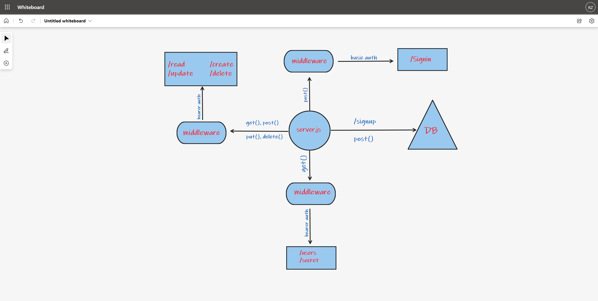

# auth-api

## Author: Rami Zregat

## Project:

## Lab 

**Description of today lab:**   

## Links to check:

- Heroku application for main branch: 

- Github actions link: 

- Github pull request link: 

## Dependencies:  

- morgan
- method-override
- jsonwebtoken
- eslint
- cors
- bcrypt
- base-64
- dotenv
- express
- jest
- supertest
- pg
- sequelize
- sequelize-cli
- sqlite3

## How to start the server:  
- pgstart
- npm start

## What should I run on the terminal or postman?  
- npm run test / on the terminal
- POST - http://localhost:3030/signup
- POST - http://localhost:3030/signin
- POST - http://localhost:3030/api/v1/food
- GET - http://localhost:3030/api/v1/food
- GET - http://localhost:3030/api/v1/food/1
- PUT - http://localhost:3030/api/v1/food/1
- DELETE - http://localhost:3030/api/v1/food/1
- POST - http://localhost:3030/api/v1/clothes
- GET - http://localhost:3030/api/v1/clothes
- GET - http://localhost:3030/api/v1/clothes/1
- PUT - http://localhost:3030/api/v1/clothes/1
- DELETE - http://localhost:3030/api/v1/clothes/1
- POST - http://localhost:3030/api/v2/food
- GET - http://localhost:3030/api/v2/food
- GET - http://localhost:3030/api/v2/food/1
- PUT - http://localhost:3030/api/v2/food/1
- DELETE - http://localhost:3030/api/v2/food/1
- POST - http://localhost:3030/api/v2/clothes
- GET - http://localhost:3030/api/v2/clothes
- GET - http://localhost:3030/api/v2/clothes/1
- PUT - http://localhost:3030/api/v2/clothes/1
- DELETE - http://localhost:3030/api/v2/clothes/1

## UML

